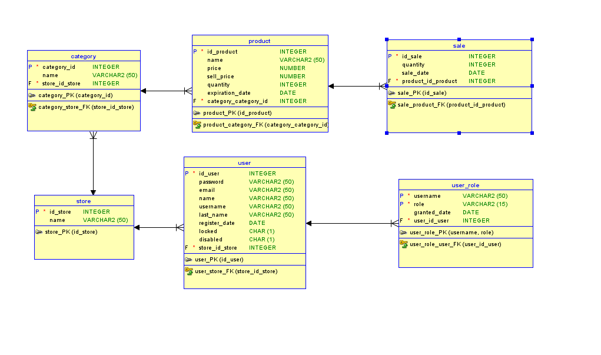

 1. Resumen del Proyecto

Nombre del proyecto: FOOD EASY

El objetivo general del proyecto es proporcionar un software de gestión de inventarios para negocios y pymes pequeñas, las cuales demandan simplicidad y rapidez en el uso de productos de gestión de inventario.

El público general son negocios y pymes pequeñas que gestionen inventario de productos.

Stack tecnológico (backend): 
-Java 21
-Spring boot (Spring security, Spring JPA, Starter test, entre otros)
-Auth0
-Mysql
-Lombok
-Swagger

Arquitectura general : En este proyecto se uso la arquitectura por capas en la cuál se busca cumplir con el principio de separación de responsabilidades, de tal forma que cada capa se encarga de una tarea definida. Tenemos la capa de presentación que se encarga de presentar la información al usuario de manera agradable y fluida al usuario, la capa de negocio que se encarga de aplicar las reglas de negocio y validaciones, la capa de persistencia que se encarga de comunicarse con la base de datos y darle las respectivas instrucciones y finalmente la capa de base de datos que se encarga de almacenar y administras la información correspondiente a las necesidades del negocio.

2. Arquitectura y Estructura del Proyecto

Diagrama de arquitectura: La arquitectura por capas divide el software en módulos independientes como presentación (UI), lógica de negocio, y acceso a datos, donde cada capa solo interactúa con la inmediatamente inferior, mejorando mantenimiento, escalabilidad y prueba.

3. Backend

Lenguaje y framework : Java con Spring Boot

Estructura de carpetas:
- **config**  
  Contiene:
  - Configuraciones de seguridad (filtros por URL).
  - CorsConfig para filtrar peticiones según origen.
  - Clases relacionadas con JWT (creación y validación de tokens).
  - Métodos utilitarios como el encriptado de contraseñas.

- **controller**  
  Contiene:
  - Controladores que reciben las peticiones HTTP.
  - Encargados de redirigir las solicitudes según su funcionalidad.
  - Ejemplo: AuthController maneja los endpoints para la autenticación de usuarios.

- **model**  
  Contiene:
  - Clases para mapear los objetos a la base de datos.
  - DTOs (Data Transfer Objects) para exponer datos de forma segura.
  - DAOs (Data Access Objects) para interactuar directamente con la base de datos.

- **service**  
  Contiene:
  - La capa de negocio, encargada de aplicar las reglas específicas de la aplicación.
  - Valida la lógica antes de pasar al controller o al acceso a datos.

Diagrama de entidades (modelo de datos): 

Explicación de entidades : El modelo ded datos tiene entidades como user_role para guardar los roles asociados al usuario, user para guardar a los respectivos usuarios, store para guardar los negocios, category para guardar las categorias, productos para guardar los respectivos productos y ventas para registrar las ventas que se han realizado.

Rutas/endpoints disponibles: Las rutas disponibles se pueden presenciar en http://localhost:{puerto}/swagger-ui.html al arrancar el backend mediante swagger.

Lógica de negocio principal:

Gestión de usuarios y roles:
Permite crear, actualizar y eliminar usuarios, asignarles uno o varios roles mediante la entidad user_role, y controlar su acceso a las funciones del sistema.

Gestión de tiendas (store):
Permite al adminsitrador del sistema  registrar nuevos negocios con sus respectivos dueños.

Gestión de categorías y productos:
Permite crear y asignar categorías a productos, gestionar la información de los productos (nombre, precio, stock, etc.), y mantenerlos organizados para la venta.

Procesamiento de ventas:
Permite registrar las ventas realizadas, actualizando automáticamente el stock de productos y generando los registros necesarios para reportes.

Autenticación y autorización:
El backend verifica credenciales de usuario (autenticación) y asegura que solo usuarios con permisos adecuados puedan realizar acciones específicas (autorización), usando JWT.

Autenticación y autorización: La autorización ocurre mediante el backend con validaciones mediante el filtro de spring security (SecurityFilterChain) en el cual se validan las url y los usuarios que pueden o no realizar acciones mediante JWT.

Conexión con base de datos:

Spring Data JPA: capa de abstracción sobre JPA para simplificar el acceso a datos.

Hibernate: proveedor ORM que gestiona la conversión entre entidades Java y tablas relacionales.

Datasource configurado en application.properties: define los parámetros de conexión (URL, usuario, contraseña, dialecto).

4. Seguridad

En el proyecto se implementaron varias medidas de seguridad clave para proteger tanto los datos como el acceso a la aplicación:

Protección contra ataques comunes:

Configuración de CORS (Cross-Origin Resource Sharing) para controlar los orígenes permitidos y prevenir solicitudes no autorizadas desde dominios externos.

Uso de Spring Security para manejar de forma centralizada las políticas de autenticación y autorización.

Gestión de contraseñas:

Las contraseñas de los usuarios no se almacenan en texto plano; se usa bcrypt para aplicar hashing , asegurando que incluso si la base de datos se ve comprometida, las contraseñas no sean fácilmente recuperables.

Autenticación segura:

Implementación de JWT (JSON Web Tokens) para la autenticación sin estado (stateless), permitiendo gestionar sesiones de usuario de manera eficiente y segura.

Los tokens se generan tras un login exitoso y se usan para autenticar las solicitudes subsecuentes, reduciendo la exposición de credenciales sensibles.

5. Proceso de despliegue (manual)

1️⃣ Preparar Docker Compose para entorno local
En el proyecto tienes algo así:

./frontend/Dockerfile  
/backend/Dockerfile  
docker-compose.yml  
El docker-compose.yml orquesta:

frontend

backend

base de datos MySQL

Comando para levantar todo localmente:

docker-compose up --build
Esto construye imágenes y levanta contenedores para todos los servicios.

Para verificar el contenedor:

docker ps

2️⃣ Poblar la base de datos con el administrador del sistema y agregar un negocio

docker exec -it mysql_db mysql -u root -p

INSERT INTO user (disabled, id_users, locked, register_date, store_id_store, password, email, last_name, name, username)
VALUES (0, 1, 0, NOW(), NULL, '$2a$12$t2IZfR70Jv4Ws7sUatJbdeyj.hXJ13ZARZU4pcZvzzZPVO46u0IA2', 'usuario@example.com', 'Apellido', 'Nombre', 'usuario');

INSERT INTO user_role (granted_date, role, username)
VALUES 
(NOW(), 'ADMIN_SYSTEM', 'usuario'),
(NOW(), 'OWNER', 'usuario'),
(NOW(), 'ADMIN', 'usuario'),
(NOW(), 'USER', 'usuario');

Password del usuario: password123

Para generar otra password ingresar a https://bcrypt-generator.com/ y generar el hash de la contraseña.

Después el usuario administrador del sistema puede autenticarse en http://localhost:8081/api/v1/auth

y posteriormente llamar al endpoint para crear un negocio con su dueño y credenciales:

{
  "user": {
    "username": "usuario2",
    "email": "usuario2@example.com",
    "password": "password123",
    "name": "usuario2",
    "lastname": "usuario2",
    "roles": ["ADMIN", "OWNER","USER"]
  },
  "store": {
    "name": "food easy"
  }
}

3️⃣ Pruebas locales

Accede a las URLs locales (ej. localhost:5173 para frontend, localhost:8081 para backend).
Verifica conexión a MySQL (el contenedor debe estar corriendo y accesible).

4️⃣Despliegue en Render (backend y frontend)

Como Render no permite docker-compose directamente, deberás:

Crear 2 servicios web separados en Render:

uno para el frontend

uno para el backend

Usar un servicio externo para MySQL (puede ser Render Database, PlanetScale, AWS RDS, etc.)

Pasos para cada servicio:

Conectar el repo al servicio Render.

Indicar la ruta del Dockerfile correspondiente (Render permite configurar el subdirectorio).

Configurar las variables de entorno (incluyendo la URL de la base de datos externa, primero hay que crear la base de datos externa).

Elegir región y plan.

Entornos

Desarrollo	Levantado localmente con docker-compose, simulando todos los servicios.
Producción	Render levanta 2 servicios web (frontend y backend) y una base de datos externa (MySQL gestionado).

Herramientas

Docker	Contenerización de backend y frontend.
Docker Compose	Orquestación local de frontend, backend y MySQL.
Render	Despliegue en la nube (sin Compose, usando servicios web independientes ya que no se puede desplegar con docker compose).
MySQL (externo)	Base de datos en la nube (Render Database, PlanetScale, AWS RDS, etc.).

6. Guía de Instalación

Consulta la [Guía de Instalación del backend](./backend/backend_food_easy/README.md) para más detalles.

